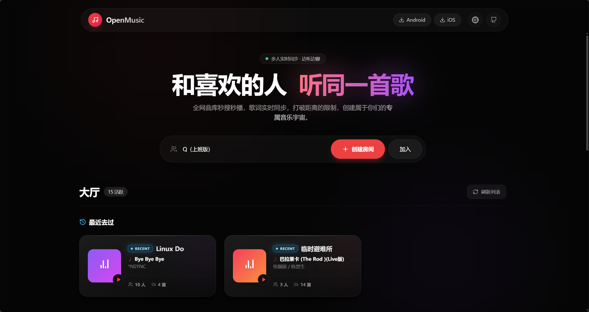
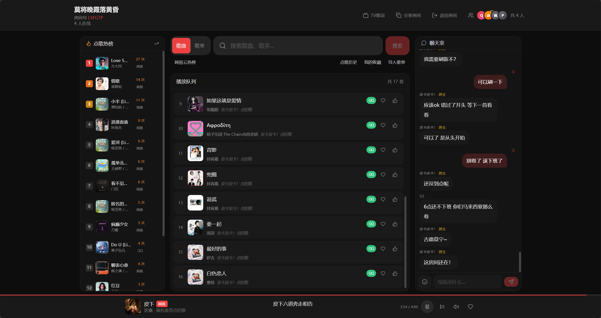
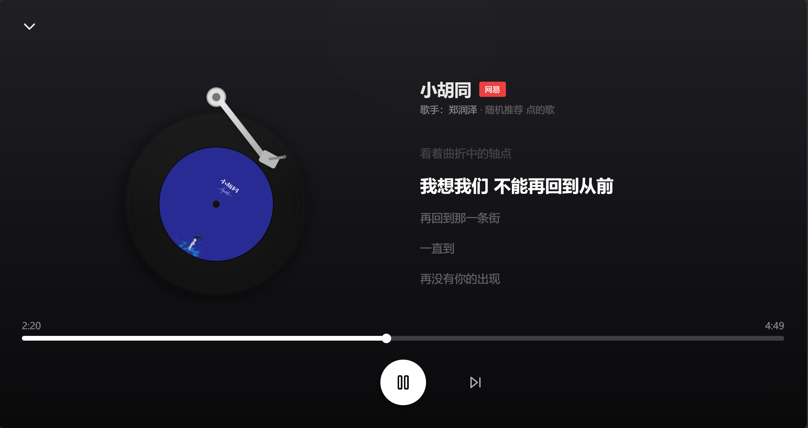

# OpenMusic

多人实时在线点歌系统。支持 **网易云 / QQ 音乐 / 酷狗** 三平台搜索点歌，房间内播放队列、进度、歌词多端同步。

**在线体验**：[http://m.qqovo.cn/](http://m.qqovo.cn/)

[](LICENSE)
[](https://nodejs.org/)

<p align="center">
  
  <br /><br />
  
  <br /><br />
  
</p>

---

## 目录

- [功能特性](#功能特性)
- [快速开始（开发）](#快速开始开发)
- [生产部署](#生产部署)
- [环境变量](#环境变量)
- [HTTP API](#http-api)
- [WebSocket 事件](#websocket-事件)
- [项目结构](#项目结构)
- [免责声明](#免责声明)

---

## 功能特性

### 音乐搜索与点歌

- **三平台并行搜索**：网易 / QQ / 酷狗结果交替展示，可按平台筛选
- **跨平台去重**：可选开启「歌名 + 歌手」去重，优先级网易 > QQ > 酷狗
- **歌单导入**：粘贴网易云 / QQ 音乐歌单分享链接，批量解析入队（QQ 需配置迟言 API）
- **网易云热榜**：一键浏览网易云热歌榜并批量点歌
- **点歌热榜**：全站点歌次数排行，房间内一键加入队列（Redis 持久化）
- **个人收藏**：跨房间收藏歌曲（最多 5000 首），支持 JSON 导入 / 导出
- **点歌历史**：房间内保留最近点歌记录，可快速复播

### 房间与播放

- **房间大厅**：展示在线房间（人数、正在播放、队列长度），每 5 秒自动刷新
- **房间命名与密码**：创建时可自定义名称，可选密码保护
- **随机昵称**：未填写昵称时自动生成（前缀 + 两位数字），保存在浏览器本地
- **持久身份**：浏览器生成 `clientId`，配合 `CLIENT_ID_SECRET` 签名，用于收藏、房主恢复、踢人封禁
- **房主机制**：创建者重新进入时优先恢复房主；房主负责播放 / 暂停 / 进度 / 切歌
- **播放队列**：最多 200 首；队列为空时自动播放迟言随机推荐（`wyrp.php`），同房间不重复并预取下一首
- **队列排序**：房主插队优先 > 点赞数 > 点歌时间
- **插队**：点歌者或房主可将自己的歌直接插到下一首；房主插队带最高优先级
- **切歌申请**：非房主成员可申请切歌，由房主审批
- **智能时长**：接口元数据 → 音频文件时长 → 歌词末行 + 20 秒；播放到有效时长自动切歌
- **预加载**：房主端预解析下一首播放地址，队列前几首提前缓冲
- **HTTPS 媒体代理**：自动将通过 `http` 提供的音频 / 封面走 `/api/media-proxy`，避免混合内容警告

### 多端同步与播放

- **实时同步**：播放 / 暂停 / 进度 / 歌词全房间 WebSocket 同步
- **音频解锁**：浏览器限制自动播放时弹出「点击开启声音」；微信 / 移动端进入正在播放的房间会立即提示，授权后会话内有效（刷新页面需重新授权）
- **电视模式**：`/tv/:roomId` 大屏展示封面与歌词（只读，不参与播控）

### 房间社交

- **在线用户**：展示昵称、归属地（IP 解析）、房主标识
- **房主管理**：踢人（被踢用户无法再次进入）、转让房主
- **文字聊天**：支持 QQ 表情、@ 提及、回复
- **分享**：一键复制房间链接或电视投屏地址

### 数据持久化

- **Redis（可选）**：房间歌单、播放进度、密码、点歌热榜、个人收藏持久化；未配置时仅内存，重启后丢失
- **空房间回收**：房间无人 10 分钟后自动销毁

---

## 快速开始（开发）

**要求**：Node.js >= 18

```bash
git clone https://github.com/wqqqqqq200/openmusic.git
cd openmusic

npm run install:all
cp server/.env.example server/.env
# 至少配置 METING_API_URL

npm run dev
```

| 服务 | 地址 |
|------|------|
| 前端（Vite） | http://localhost:5173 |
| 后端（Express + Socket.IO） | http://localhost:4000 |

打开前端 → 输入昵称（留空则自动生成）→ 在大厅创建 / 加入房间 → 搜索点歌。

**使用流程简述**

1. 首页查看在线房间，或创建新房间（可设密码）
2. 进入房间后搜索点歌，或从热榜 / 收藏 / 歌单导入批量添加
3. **房主**控制播放 / 暂停 / 进度 / 切歌；**所有成员**本地同步收听
4. 电视大屏访问 `/tv/房间号`

---

## 生产部署

### 前置依赖

1. **Meting-API**（必填，网易云 + QQ 播放 / 歌词 / 封面 / 网易歌单导入）

```bash
docker pull ghcr.io/mikus-loli/meting-api:latest
docker run -d --name meting -p 3000:3000 ghcr.io/mikus-loli/meting-api:latest
```

建议在 Meting 管理后台（`/admin`，默认 `admin` / `admin123`）配置网易云 Cookie。

2. **迟言 API Key**（可选，QQ 搜索 + 酷狗 + 队列为空随机推荐 + QQ 歌单导入）

在 [迟言 API](https://cyapi.top/) 注册获取 `apikey`。不配置时仅网易可用；队列为空时也无法自动随机播歌。

3. **Redis**（推荐，房间持久化 + 点歌热榜 + 个人收藏）

### 方式一：Node 直接托管

生产环境由 **同一 Node 进程** 托管 API、WebSocket 与 `client/dist` 静态资源，只需暴露一个端口（默认 `4000`）。

```bash
git clone https://github.com/wqqqqqq200/openmusic.git
cd openmusic

npm run install:all
npm run build          # 构建前端 → client/dist
# 或 npm run package:build  # 一键打包 → release/openmusic-build.zip

cp server/.env.example server/.env
# 生产至少配置 CLIENT_URL、CLIENT_ID_SECRET、METING_API_URL

npm start              # 默认 http://服务器IP:4000
```

### 方式二：宝塔 / PM2

```bash
npm run install:all
npm run build
# 或 npm run package:build
```

上传 `server/`、`client/dist/`、`deploy/` 到服务器，配置 `.env` 后用 PM2 启动。**请保持单实例运行**（房间状态在进程内存中，多实例会导致同步异常）。详细步骤见 [deploy/DEPLOY-BAOTA.md](deploy/DEPLOY-BAOTA.md)。

### 打包命令

| 命令 | 说明 |
|------|------|
| `npm run build` | 仅构建前端，产物在 `client/dist` |
| `npm run package:build` | 构建前端并组装 `release/openmusic/`，输出 `release/openmusic-build.zip` |

### Nginx 反向代理

**必须**为 `/socket.io` 配置 WebSocket 升级，否则实时同步失效：

```nginx
location /socket.io/ {
    proxy_pass http://127.0.0.1:4000;
    proxy_http_version 1.1;
    proxy_set_header Upgrade $http_upgrade;
    proxy_set_header Connection "upgrade";
    proxy_set_header Host $host;
    proxy_set_header X-Forwarded-For $proxy_add_x_forwarded_for;
    proxy_set_header X-Real-IP $remote_addr;
}
```

完整示例：[deploy/nginx.conf.example](deploy/nginx.conf.example)

> 限流、IP 归属地等功能依赖反代正确转发 `X-Forwarded-For` / `X-Real-IP`。排查时可设置 `DEBUG_IP=1` 查看解析日志。

---

## 环境变量

在 `server/.env` 中配置（参考 `server/.env.example`）：

| 变量 | 必填 | 说明 |
|------|:----:|------|
| `PORT` | | 服务端口，默认 `4000` |
| `NODE_ENV` | 生产推荐 | 设为 `production` 时未配置 `CLIENT_URL` 会拒绝浏览器跨域 |
| `CLIENT_URL` | 生产必填 | 允许的前端 Origin，多个用英文逗号分隔，如 `https://music.example.com` |
| `CLIENT_ID_SECRET` | 生产必填 | 浏览器会话签名密钥，填一段长随机字符串，**重启后不要变化** |
| `METING_API_URL` | 必填 | Meting-API 地址，如 `http://127.0.0.1:3000` |
| `METING_API_AUTH` | 推荐 | Meting 的 `auth` 令牌 |
| `CYAPI_KEY` | 可选 | 迟言 API Key，用于 QQ / 酷狗 / 随机推荐 / QQ 歌单 |
| `CYAPI_BASE` | 可选 | 迟言 API 根地址，默认 `https://cyapi.top/API` |
| `CYAPI_URL` | 可选 | 迟言 QQ 接口完整 URL，覆盖 `CYAPI_BASE` 拼接 |
| `VMY_LRC_URL` | 可选 | 歌词备用接口（按歌名），默认已内置 |
| `REDIS_URL` | 可选 | Redis 连接串；配置后启用持久化 |
| `REDIS_HOST` | 可选 | Redis 地址；与 `REDIS_URL` 二选一 |
| `REDIS_PORT` | | 端口，默认 `6379` |
| `REDIS_USERNAME` | | 用户名，无则留空 |
| `REDIS_PASSWORD` | | 密码，无则留空 |
| `REDIS_DB` | | 数据库编号，默认 `0` |
| `DEBUG_IP` | 可选 | 设为 `1` 时打印 IP 解析调试日志 |

**生产最小配置（仅网易云）**

```env
PORT=4000
NODE_ENV=production
CLIENT_URL=https://music.example.com
CLIENT_ID_SECRET=换成一段长随机字符串
METING_API_URL=http://127.0.0.1:3000
METING_API_AUTH=你的meting_token
```

**三平台完整配置**

```env
PORT=4000
NODE_ENV=production
CLIENT_URL=https://your-domain.com
CLIENT_ID_SECRET=换成一段长随机字符串
METING_API_URL=http://127.0.0.1:3000
METING_API_AUTH=你的meting_token
CYAPI_KEY=你的迟言apikey
```

**生产环境推荐（持久化）**

```env
REDIS_URL=redis://127.0.0.1:6379/0
```

或使用分项配置（`REDIS_HOST` / `REDIS_PORT` / `REDIS_PASSWORD` 等，见 `.env.example`）。

---

## HTTP API

### 健康检查

| 方法 | 路径 | 说明 |
|------|------|------|
| `GET` | `/api/health` | 返回 `{ "ok": true }` |

### 房间

| 方法 | 路径 | 说明 |
|------|------|------|
| `GET` | `/api/rooms` | 获取所有房间摘要（人数、正在播放、是否有密码等） |
| `POST` | `/api/rooms` | 创建房间，请求体 `{ "name": "房间名称", "password": "可选密码", "creatorId": "可选创建者ID" }` |
| `GET` | `/api/rooms/:id` | 检查房间是否存在；密码房仅返回摘要，不泄露歌单 |

加入房间时通过 Socket `join_room` 传入 `password` 校验。

### 音乐

| 方法 | 路径 | 说明 |
|------|------|------|
| `GET` | `/api/music/hot?limit=20` | 全站点歌热榜（按点歌次数排序） |
| `GET` | `/api/music/toplist/netease?limit=200` | 网易云热歌榜 |
| `GET` | `/api/music/netease/playlists/search?keyword=` | 网易云歌单搜索 |
| `GET` | `/api/music/sources` | 可用音乐平台及搜索能力 |
| `GET` | `/api/meting?...` | Meting-API 代理 |
| `GET` | `/api/media-proxy?url=` | HTTP 媒体同源代理（HTTPS 站点用） |
| `GET` | `/api/music/cyapi/search?q=` | QQ 音乐搜索（需 `CYAPI_KEY`） |
| `GET` | `/api/music/cyapi/kugou/search?q=` | 酷狗音乐搜索 |
| `GET` | `/api/music/cyapi/kugou/song?id=` | 酷狗歌曲详情 |
| `POST` | `/api/music/playlist/import` | 导入歌单，请求体 `{ "platform": "netease\|qq", "input": "分享链接" }` |
| `GET` | `/api/music/lrc-fallback?msg=` | 歌词备用（按歌名） |

---

## WebSocket 事件

连接：`/socket.io`（与 HTTP 同端口）

### 客户端 → 服务端

| 事件 | 说明 |
|------|------|
| `join_room` | 加入房间（`roomId`, `nickname`, `password`, `readOnly`, `clientId`, `clientToken`） |
| `leave_room` | 离开房间 |
| `add_song` | 点歌入队 |
| `remove_song` | 从队列删除（房主或点歌者） |
| `skip_song` | 切歌（仅房主） |
| `finish_song` | 结束当前歌曲（仅房主） |
| `toggle_play` | 播放 / 暂停（仅房主） |
| `seek` | 调节进度（仅房主） |
| `request_jump` | 插队到下一首（点歌者或房主） |
| `toggle_queue_like` | 队列歌曲点赞 |
| `request_skip` | 申请切歌（非房主） |
| `approve_skip` / `reject_skip` | 审批切歌申请（仅房主） |
| `rename_user` | 修改昵称 |
| `kick_user` | 踢人（仅房主） |
| `transfer_owner` | 转让房主 |
| `send_chat` | 发送聊天（支持 `mentions`, `replyTo`） |
| `list_favorites` | 获取个人收藏 |
| `set_favorite` | 添加 / 取消收藏 |
| `import_favorites` | 批量导入收藏 |

### 服务端 → 客户端

| 事件 | 说明 |
|------|------|
| `room_update` | 房间状态变更（队列、用户、申请等） |
| `playback_state` | 播放状态同步（进度、暂停等） |
| `kicked` | 被房主移出 |

---

## 项目结构

```
openmusic/
├── client/                 # React + Vite + Tailwind 前端
│   └── src/
│       ├── api/            # REST 接口、多平台搜索聚合
│       ├── pages/          # 首页大厅、房间页、电视模式
│       ├── components/     # 播放器、队列、聊天、歌单导入等 UI
│       ├── hooks/          # Socket、收藏、歌词、时长等
│       ├── stores/         # 房间 / 音频状态
│       └── lib/            # 音频解锁、播放同步、预加载、媒体代理等
├── server/                 # Express + Socket.IO 后端
│   ├── index.js            # HTTP 路由、WebSocket、静态托管
│   ├── roomManager.js      # 房间状态、队列、播放逻辑
│   ├── roomStorage.js      # Redis 持久化、个人收藏
│   ├── songHotRank.js      # 点歌热榜统计
│   ├── cyapi.js            # 迟言 API（QQ / 酷狗 / 随机推荐）
│   ├── playlistImport.js   # 网易云 / QQ 歌单导入
│   ├── neteaseToplist.js   # 网易云热榜抓取
│   └── loadEnv.js          # 环境变量加载
├── deploy/                 # Nginx、PM2、宝塔部署示例
├── docs/screenshots/       # README 截图
└── scripts/                # 打包脚本
```

---

## 免责声明

本项目仅供学习与技术交流使用。音乐版权归属各平台及权利人所有，请遵守相关法律法规，**不得用于商业用途**。

---

## License

[MIT](LICENSE)
