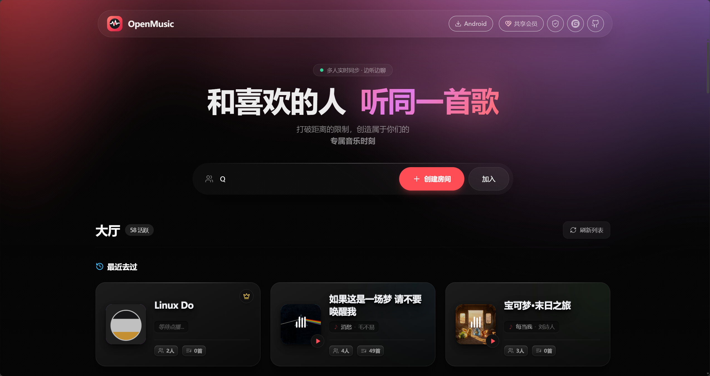
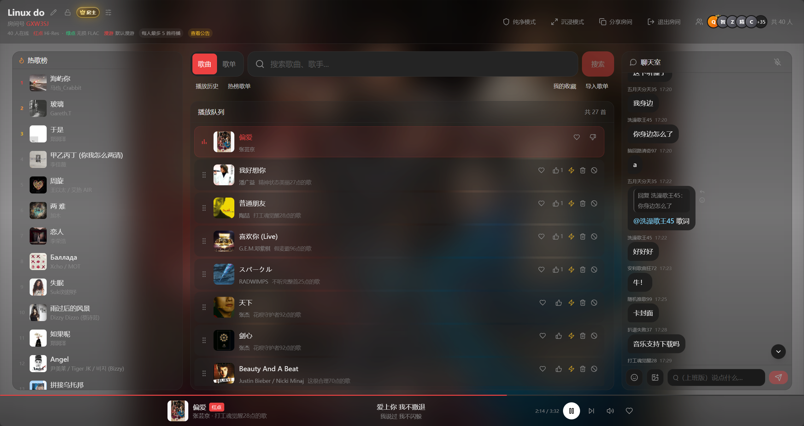
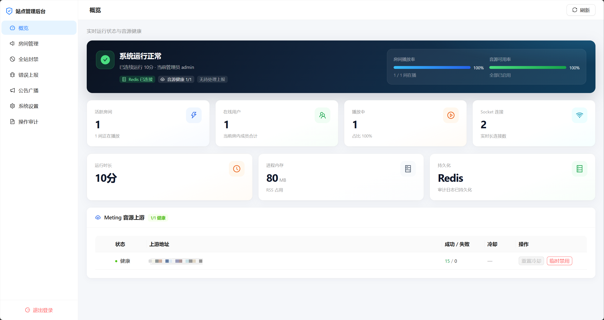
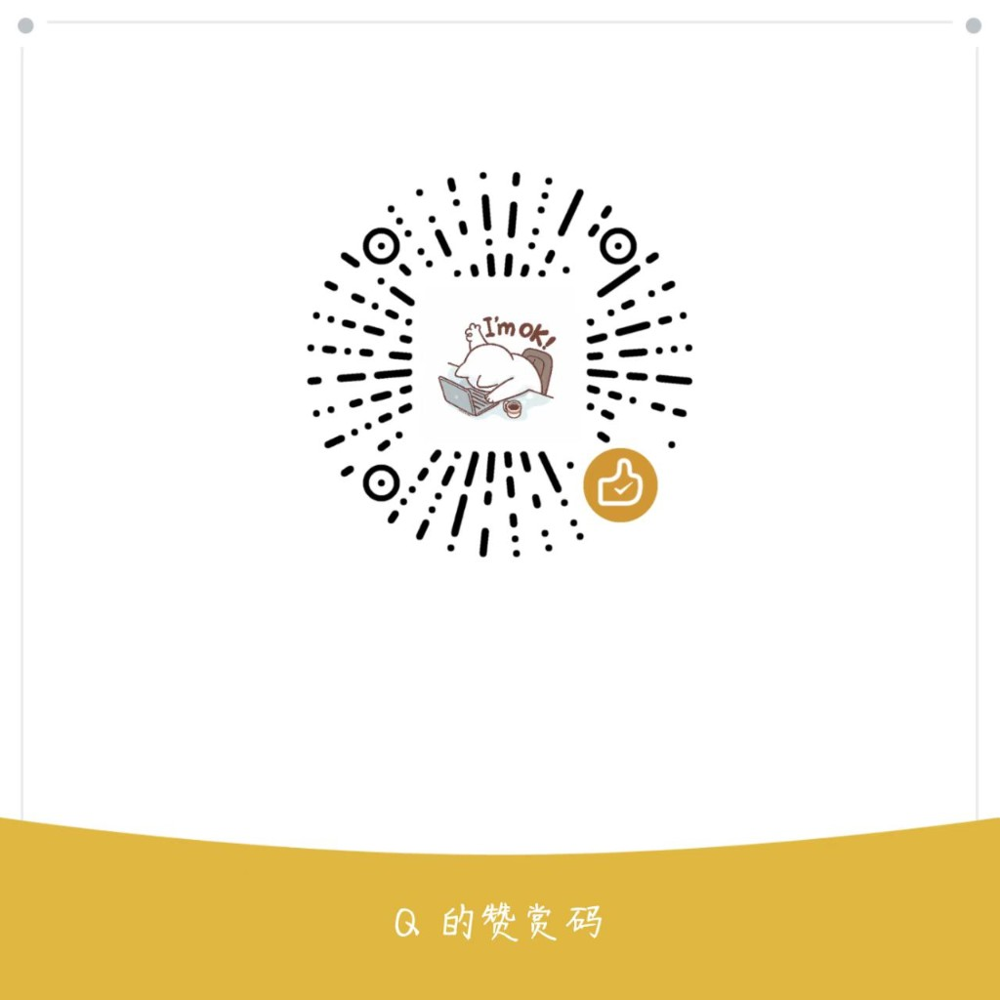

<h1 align="center">🎵 OpenMusic</h1>

<p align="center">
  <strong>多人实时在线点歌</strong><br/>
  多音源搜索 · 同步听歌 · 聊天互动 · 3D 视觉 / 沉浸模式
</p>

<p align="center">
  
  
  
</p>

<p align="center">
  <a href="#-快速开始">🚀 快速开始</a> ·
  <a href="#-功能概览">✨ 功能</a> ·
  <a href="#-ai-功能">🤖 AI</a> ·
  <a href="#-站点管理后台">🛡️ 管理后台</a> ·
  <a href="#-文档">📖 文档</a> ·
  <a href="#-请作者喝一杯咖啡">☕ 请喝咖啡</a> ·
  <a href="docs/DEPLOY.md">📖 部署文档</a> ·
  <a href="deploy/DEPLOY-BAOTA.md">🛠️ 宝塔部署</a>
</p>

---

## 📸 项目截图

<p align="center">
  <a href="docs/screenshots/home.png">
    
  </a>
  <br/>
  <sub><b>首页大厅</b></sub>
</p>

<table>
  <tr>
    <td align="center" width="50%">
      <a href="docs/screenshots/room.png"></a>
      <br/><sub><b>房间点歌</b></sub>
    </td>
    <td align="center" width="50%">
      <a href="docs/screenshots/admin.png"></a>
      <br/><sub><b>管理后台</b></sub>
    </td>
  </tr>
</table>

---

## 🚀 快速开始

### 前置依赖

| 依赖 | 必填 | 说明 |
|------|:----:|------|
| Node.js | 源码部署 | `>=20 <25`（见 `.nvmrc`） |
| Redis | 是 | 房间、收藏、凭据、公告、封禁 |
| [Meting-API](https://github.com/qq01-hub/Meting-API) | 是 | 搜索 / 播放 / 歌词 / 封面 / 歌单；提供 Docker 镜像 |
| 七牛 OSS | 否 | 聊天发图；可在管理后台配置 |

> Docker 全量版已内置 Redis 与 Meting，打开站点后填域名即可。

### Docker（推荐）

```bash
curl -O https://raw.githubusercontent.com/qq01-hub/openmusic/main/docker-compose.full.yml
mkdir -p data/downloads data/meting
touch data/.env data/setup.lock
echo '{}' > data/runtimeConfig.json
echo '{}' > data/adminConfig.json
docker compose -f docker-compose.full.yml up -d
```

| 服务 | 地址 | 说明 |
|------|------|------|
| OpenMusic | `http://<IP>:4000` | 首次进入部署向导，完成后自动重启 |
| Meting 后台 | `http://<IP>:3000/admin` | 默认 `admin` / `admin123`（仅首次无数据时生效） |

```bash
# 更新
docker compose -f docker-compose.full.yml pull && docker compose -f docker-compose.full.yml up -d

# 自定义端口
OPENMUSIC_PORT=8080 docker compose -f docker-compose.full.yml up -d
```

不需要内置 Meting 时改用 `docker-compose.yml`。宝塔面板见 [宝塔部署](deploy/DEPLOY-BAOTA.md)。

### 源码部署

```bash
git clone https://github.com/qq01-hub/openmusic.git && cd openmusic
npm run install:all && npm run build && npm start
```

打开 `http://<IP>:4000` 进入部署向导。生产环境请配置 Nginx 反代，详见 [部署文档](docs/DEPLOY.md)。

```bash
# 开发：前端 :5173，后端 :4000
npm run dev
```

---

## ✨ 功能概览

### 🎧 听歌

- 多音源搜索：网易云音乐、QQ 音乐、汽水音乐等（酷狗等可通过自定义 Music API 接入）
- **账号与漫游**：网易、QQ、汽水统一支持扫码、手动 Cookie、账号状态展示与个性化漫游；房间账号优先，否则走共享会员池；无可用汽水账号时自动锁定汽水漫游
- **本机音质**：自选偏好（含无损 / 臻音等档位，受平台与 SVIP 开关约束）；弱设备可自动降档；切换后当前曲继续播放，下一首起生效
- 多人实时同步播放；顺序 / 随机 / 单曲 / 列表循环等播放模式；可授权成员暂停与拖进度
- 网易云热歌榜（服务端缓存每 3 小时刷新）、推荐歌单、音乐电台
- 歌单导入（网易 / QQ / 汽水链接）、个人收藏与点歌历史（JSON 导入 / 导出）
- 队列拖拽排序、插队、清空；系统媒体键（可分别开关，防误触）
- 移动端后台播放（Flutter 原生客户端，见 [`mobile/`](mobile/)）

### 🏠 房间

- 大厅、密码房、最近访问、分享链接
- **自定义封面**：房主可上传房间封面，大厅卡片同步；取消后恢复跟随当前歌曲
- 站点公告 / 房间公告（进房弹窗）、网易与汽水漫游、主题色
- 房主转让、正式管理员、房主离线时临时控播
- 贵宾角标与进房欢迎、成员归属地
- 点歌规则、禁播、踩歌切歌
- **纯净模式**：隐藏动效与热榜；聊天图/贴纸可遮罩；浏览器标签页标题与图标可伪装
- **常驻房**：房主申请 → 站点管理员审核，避免空闲被自动销毁
- **身份找回（可选）**：绑定 Linux.do / GitHub，换设备或清 Cookie 后找回房主身份

### 💬 互动

- 实时聊天：贴纸、发图、回复 / @ / @全体、撤回（本人限时；房主 / 管理可撤他人）
- 全员禁言 / 单人禁言；踢人、任命管理、贵宾管理
- 房间违禁词（可自定义，含默认可删词表）
- 微信表情包采集 / 表情包搜索

### 🤖 AI 功能

- **房间 AI 助手**：在聊天中 `@` 机器人或使用触发词提问，支持连续对话和按用户隔离的上下文
- **音乐操作**：可根据自然语言搜索歌曲、查看当前播放状态、管理队列，并执行房间允许的点歌与播放操作
- **图片理解**：发送歌单截图、专辑封面等图片后，AI 可先识别图片内容，再结合音乐工具继续处理
- **房间级开关**：房主或管理员可在房间设置中启用 / 停用 AI，并自定义机器人名称
- **多模型池**：管理员可配置 OpenAI 兼容接口，分别设置文本模型和视觉模型；支持模型池切换、限流与故障降级
- **可选启用**：AI 默认关闭，不配置模型 API Key 不会影响点歌、播放、聊天等基础功能

### 🌌 视觉与客户端

- 星河 / 声波地形 3D 背景、封面模糊背景、桌面沉浸模式（舞台歌词）
- Android / iOS（重构中，暂不建议作稳定版）
- 静默 / 强制更新提示

### ⚙️ 点歌规则（房主 / 管理员）

| 规则 | 说明 |
|------|------|
| 允许成员点歌 | 关闭后仅房主与管理员可点 |
| 允许成员插队 | 成员可对自己的点歌插队 |
| 允许拖进度 / 暂停 | 可授权成员控制播放 |
| 进房等待时间 | 新成员停留满时长后才能点歌 |
| 每人最多点歌 | 队列中每人上限，`0` = 不限 |
| 点歌冷却 | 不限制 / 10s / 30s / 60s / 120s |
| 队列长度上限 | 50 / 100 / 200 |
| 禁播歌曲 | 按歌名，跨平台均不可点 |
| 踩歌切歌 | 按人数或在线比例 |
| 退出后清除已点 | 离房超时后清除其待播 |

---

## 🛡️ 站点管理后台

部署向导会生成**随机管理员账号**和**随机管理入口**（不是固定 `/admin`），仅在完成页展示一次，请立即保存。

| 场景 | 处理 |
|------|------|
| 忘记密码 | `redis-cli DEL openmusic:admin:credentials` → 重启 → 恢复默认 `admin` / `123456` |
| 忘记入口 | 查看 `server/adminConfig.json`（Docker：`data/adminConfig.json`）的 `entryPath` |

主要能力：

- 运行配置在线生效：音源 / Meting / SVIP 音质 / 共享会员 / OAuth / 七牛 / SEO 等
- AI 配置：启用房间 AI、设置机器人名称、配置文本 / 视觉模型池、API 协议、限流参数，并提供连通性测试
- 房间管理：搜索、查看密码、解散、常驻申请审核、违规重置昵称、成员拉黑
- 全站封禁（IP / 设备）、站点公告与全局广播、错误上报、操作审计
- 管理员可额外绑定 Linux.do / GitHub 作备用登录

安全要点：扫码会话服务端托管，房间 Cookie 加密存储，Meting 强制校验 HTTPS 证书。

### AI 配置说明

1. 进入管理后台 → 运行时配置 → **AI**。
2. 开启 AI，填写 OpenAI 兼容接口地址、API Key 和模型 ID；需要图片理解时，同时配置视觉模型。
3. 使用后台的文本 / 视觉连通性测试确认配置有效。
4. 进入房间设置，开启房间 AI 并设置机器人名称；之后可在聊天中 `@机器人名称` 或使用命令菜单。

API Key 仅用于服务端请求，运行配置会进行加密存储；AI 未启用或模型不可用时，房间基础功能仍可正常使用。

### 🛠️ 首页管理入口快捷方式

首页默认不展示管理入口。本机浏览器成功访问过真实入口后，会在 `localStorage` 记住路径，顶栏出现盾牌图标便于快速进入；其他访客不可见，也不会泄露路径。

---

## 🔗 第三方账号绑定（可选）

支持 **Linux.do** 与 **GitHub**（能力相同、互相独立，可只开其一）。用于：

1. 房主换设备 / 清 Cookie 后**找回房间身份**
2. 管理员额外绑定，作为密码之外的登录方式

不绑定不影响匿名建房、加房与后台密码登录；默认关闭。

### 配置步骤

1. **申请 OAuth 应用**
   - Linux.do：[connect.linux.do](https://connect.linux.do) → 回调 `https://你的域名/api/auth/linuxdo/callback`（授权 / 令牌 / 用户信息地址须按官方文档填写，项目无默认值）
   - GitHub：[OAuth Apps](https://github.com/settings/developers) → Authorization callback URL 填 `https://你的域名/api/auth/github/callback`（接口地址固定，无需额外配置）
2. **填写配置**：管理后台 → 运行时配置 →「身份登录」→ 保存即时生效
3. **绑定**
   - 房主：房间设置 →「身份」
   - 管理员：先用密码登录 → 系统设置 →「安全与账号」（接入参数在「身份登录」，绑定按钮在「安全与账号」）

> **排查**：OAuth 应用后台与本站配置中的 `redirect_uri` 须逐字符一致（协议、域名、路径、尾斜杠）。路径错误会导致回调失败或 404。

---

## 📱 Android / iOS（重构中）

> 功能与产物可能变动，暂不建议作为稳定版本使用。

路径：[`mobile/`](mobile/)（Flutter，不嵌入 WebView），与网页共用 Socket.IO 后端。详见 [移动端文档](docs/MOBILE.md)。

```bash
cd mobile
flutter pub get
flutter run --dart-define=OM_SERVER_URL=https://your-host
```

CI：`flutter-android-apk.yml` / `flutter-ios-ipa.yml`。产物发布至 `/downloads/openmusic.apk` 与 `/downloads/openmusic.ipa`。

---

## 🧱 技术栈

| 层级 | 技术 |
|------|------|
| 前端 | React · Vite · Tailwind CSS · Socket.IO Client · Three.js / R3F |
| 移动端 | Flutter · just_audio · audio_service · Socket.IO Client |
| 后端 | Node.js · Express · Socket.IO · Redis（必需） |

---

## 📖 文档

| 文档 | 说明 |
|------|------|
| [AI 协作指南](AGENTS.md) | **开发或交给 AI 修改前必读**：项目边界、高风险区域、验证流程与禁止事项 |
| [部署文档](docs/DEPLOY.md) | 环境变量、Nginx、Docker 细节、API 速查 |
| [Meting-API](https://github.com/qq01-hub/Meting-API) | 音源 API（网易 / QQ / 汽水等），含 Docker 镜像 |
| [宝塔部署](deploy/DEPLOY-BAOTA.md) | 面板 Docker / 源码部署步骤 |
| [移动端](docs/MOBILE.md) | Flutter 工程结构与本地运行 |
| [Nginx 示例](deploy/nginx.conf.example) | 通用反代配置 |
| [宝塔 Nginx 示例](deploy/nginx.baota-optimized.conf.example) | 宝塔优化版 |

常用命令：

```bash
npm run install:all   # 安装根 / server / client 依赖
npm run build         # 构建前端 → client/dist
npm start             # 启动后端（生产）
npm run dev           # 前后端同时开发
npm run package:build # 组装发版包
```

健康检查：`GET /api/health`

---

## ☕ 请作者喝一杯咖啡

如果 OpenMusic 对你有帮助，欢迎请作者喝杯咖啡，支持持续维护。

<table>
  <tr>
    <td align="center" width="50%" valign="top">
      <a href="docs/donate/wechat.png">
        
      </a>
      <br/><sub><b>微信</b></sub>
    </td>
    <td align="center" width="50%" valign="top">
      <a href="docs/donate/alipay.png">
        
      </a>
      <br/><sub><b>支付宝</b></sub>
    </td>
  </tr>
</table>

---

## 🙏 致谢

| 项目 | 作者 | 说明 |
|------|------|------|
| [Mineradio](https://github.com/XxHuberrr/Mineradio) | [@XxHuberrr](https://github.com/XxHuberrr) | 星河粒子、沉浸玻璃质感、舞台歌词等 |

## 🔗 友情链接

- [Linux.do](https://linux.do/) — 新的理想型社区

## ⚠️ 免责声明

本项目仅供学习与技术交流。不存储音频文件，音乐版权归相关权利人所有。请遵守法律法规及平台协议，不得用于商业用途。

## 📄 License

[MIT（附注明出处条款）](LICENSE)：可自由使用、修改、分发；公开分发或部署时须注明出处（项目名「OpenMusic」及原始仓库链接）。
